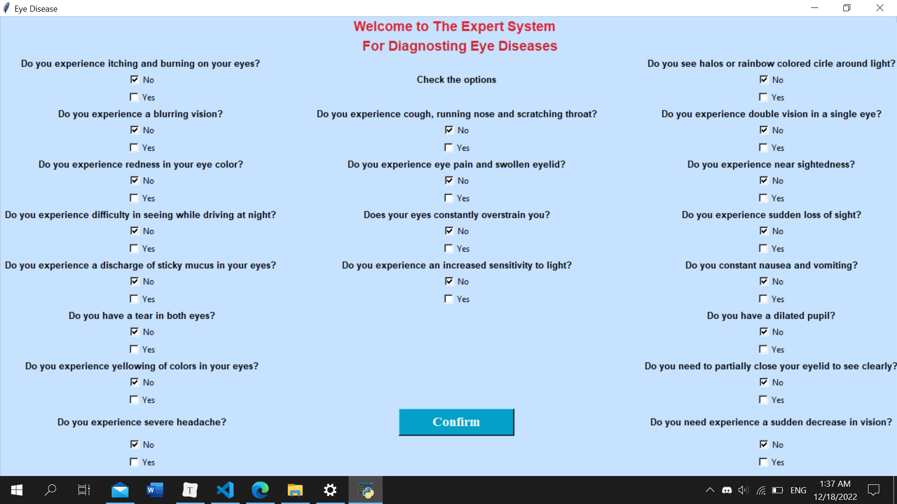
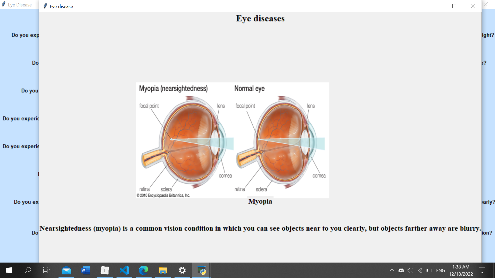
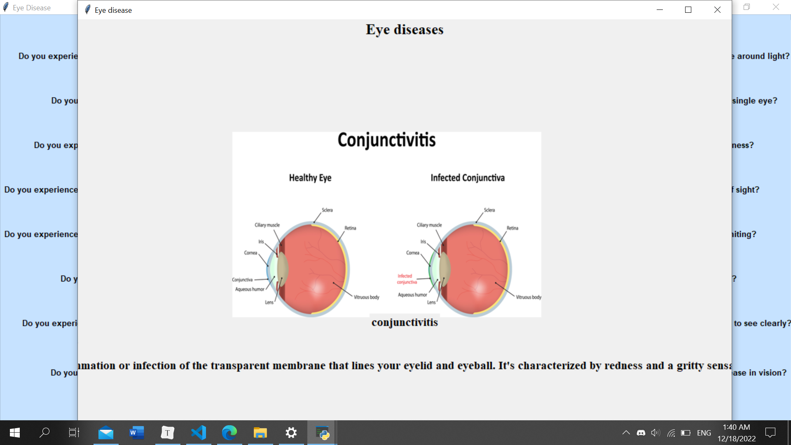
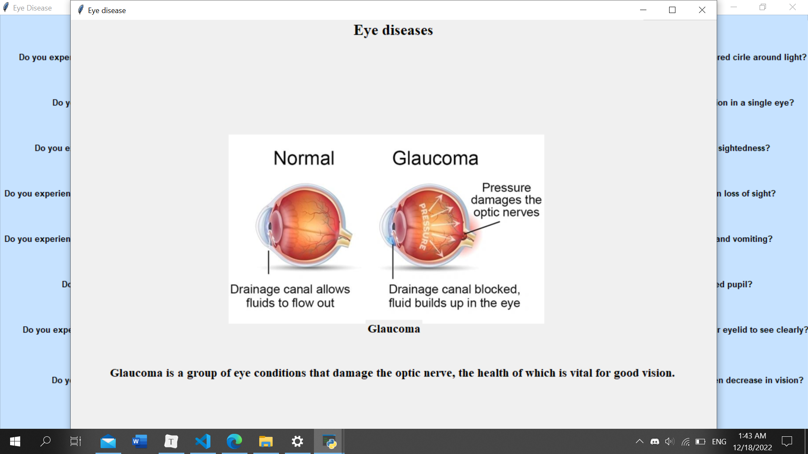
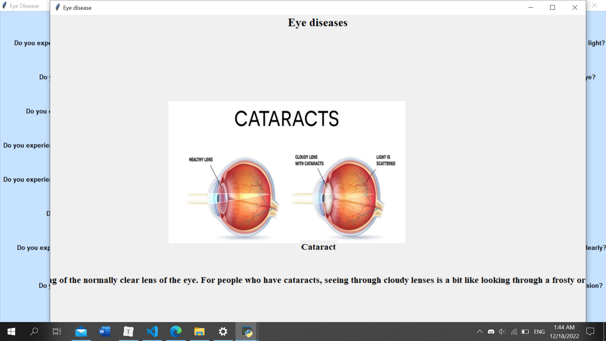
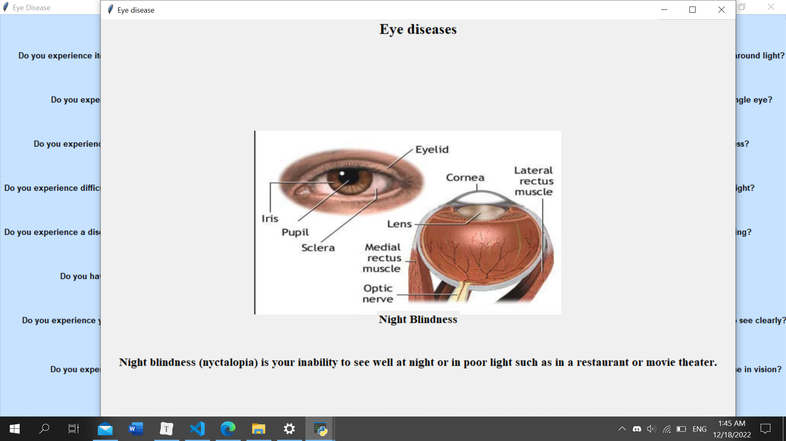
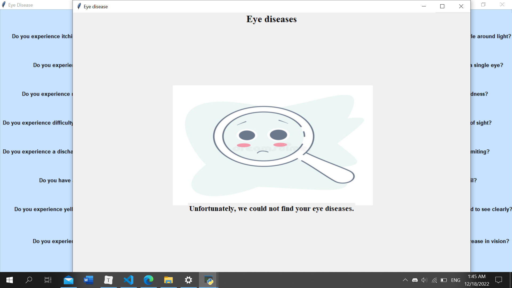

# Simple Expert System 

 #### This program  is an Expert System based on [Experta libaray](https://experta.readthedocs.io/en/latest/) and [Tkinter Library (GUI)](https://docs.python.org/3/library/tkinter.html)for Diagnosing  Eye Diseases 
 
 > This project is an application of what we have learned in the expert systems course and **that is not usable in real life** 
 
 ## How to Run it
 Make Sure That you Install ```Experta Library``` and ```Tkinter Library```
 - open CMD 
 - write ```pip install experta``` 
 - write ```pip install tk```   
 - make clone this project and make sure that you have installed ``git`` in your PC
 - then write in command prompet (CMD) ```git clone https://github.com/0xGhada/Simple-Expert-System.git```
 - then open your IDE and ```run```project 
 > make sure that You open file ```GUIeye.py```of the project to show GUi and interact with it ... enjoy! 
 
 ## About Project 
 #### the Main Window of program for select your symptoms <br>
 <br>
 -----------
#### If you select that you have [blurring, night, headache, overstrain, sightedness, eyelid] your Result will appear that you have Myopia<br>
 <br>
 ----------
 #### If you select that you have [itching, blurring, redness, mucus, tear, pain,overstrain,sensitivity] your Result will appear that you have Conjunctiva<br>
 <br>
 --------
 #### If you select that you have [itching, redness, night, mucus, pain, sensitivity,sight] your Result will appear that you have Ocular Allergy<br>
 <br>
 --------
 #### If you select that you have [blurring,redness, night,yellowing , pain, rainbow, sight,nausea, dilated] your Result will appear that you have Glaucoma<br>
 <br>
 ---------
 #### If you select that you have [blurring, night, yellowing, sensitivity, rainbow, Double,sightedness] your Result will appear that you have Cataract<br>
 <br>
 --------
 #### If you select that you have [blurring, night,sensitivity,rainbow, sight,sightedness] your Result will appear that you have night blindness<br>
 <br>
 ---------
 #### If You can't find your Disease that will appear<br>
 <br>
 --------
## Reference
> Thanks for this repository
[expert-system by RaniaRekik](https://github.com/RaniaRekik/expert-system)
 
 
